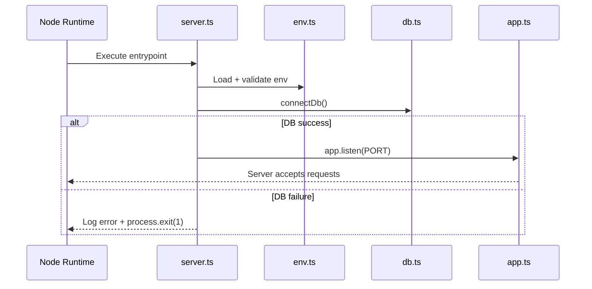
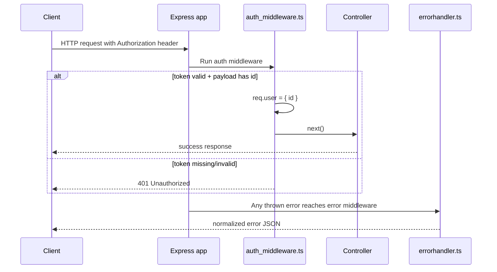
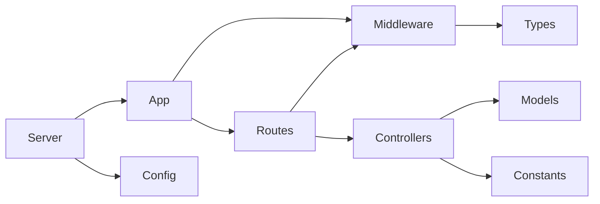

# Contact Backend TS — Architecture Explanation

This document explains how the current TypeScript backend is wired, why each file exists, and how requests flow through the system.

---

## 1) High-level picture

The project is organized around a simple startup pipeline and middleware-driven request handling:

```mermaid
flowchart TD
    A[server.ts] --> B[env.ts validates env vars]
    A --> C[db.ts connects MongoDB]
    A --> D[app.ts starts Express app]

    D --> E[Global middleware: express.json()]
    D --> F[Routes]
    F --> G[auth_middleware.ts (protected routes)]
    F --> H[controllers (next step)]
    D --> I[errorhandler.ts (last middleware)]

    G --> J[express.d.ts type augmentation: req.user]
```

**Key idea:** `server.ts` bootstraps the app; `app.ts` defines HTTP behavior; middleware creates boundaries for security and error handling.

---

## 2) File-by-file purpose and importance

## `src/server.ts` (Startup orchestrator)
- Calls DB connection first.
- Starts HTTP server only after DB succeeds.
- Handles fatal startup errors and exits process.

**Why important:** prevents the app from serving requests while dependencies are unavailable.

---

## `src/app.ts` (Express composition root)
- Creates Express app instance.
- Registers JSON parser.
- Declares health route.
- Registers error middleware last.

**Why important:** this is where middleware order is controlled. In Express, order is behavior.

---

## `src/config/env.ts` (Runtime configuration boundary)
- Loads `.env` values using `dotenv`.
- Validates required env variables.
- Exports one typed config object.

**Why important:** centralizes config validation so other files do not touch `process.env` directly.

---

## `src/config/db.ts` (Database boundary)
- Connects Mongoose to MongoDB.
- Reports connection errors.
- Should fail fast on unrecoverable startup errors.

**Why important:** isolates DB lifecycle concerns from HTTP route logic.

---

## `src/middleware/auth_middleware.ts` (Authentication gate)
- Reads `Authorization` header (`Bearer <token>`).
- Verifies JWT.
- Narrows payload type and attaches `req.user`.
- Blocks unauthorized requests.

**Why important:** creates trust boundary between external input and internal route access.

---

## `src/middleware/errorhandler.ts` (Global error response)
- Captures unhandled route/middleware errors.
- Normalizes response shape.
- Prevents leaking raw failures to clients.

**Why important:** gives consistent client error contracts and centralizes logging behavior.

---

## `src/types/express.d.ts` (Express Request augmentation)
- Extends `Express.Request` with optional `user`.
- Allows type-safe `req.user` usage across middleware/controllers.

**Why important:** avoids repeated unsafe casts and keeps auth context type-safe.

---

## `src/constants/constants.ts` (Shared literals)
- Central status codes and error message constants.

**Why important:** avoids magic numbers/strings and keeps response semantics consistent.

---

## 3) Startup sequence diagram



---

## 4) Protected request flow diagram



---

## 5) Why middleware order matters

Express executes middleware top-to-bottom:
1. Parse body (`express.json()`)
2. Route handlers / route-level middleware
3. Error middleware (`errorhandler.ts`) **must be last**

If error middleware is registered too early, route errors can bypass it.

---

## 6) TypeScript-specific design choices used here

- Strict mode catches unsafe assumptions at compile time.
- `unknown` in `catch` blocks forces safe narrowing.
- Request augmentation (`express.d.ts`) is preferred over repeated type assertions.
- Central env validation turns runtime surprises into startup failures.

---

## 7) Current maturity and next connections

Current foundation is correct for scaling into:
- `routes/` (route declarations)
- `controllers/` (request orchestration)
- `models/` (Mongoose schemas/types)

Expected dependency direction:



Keep dependencies one-way where possible (avoid circular imports).

---

## 8) Quick health checklist for this codebase

- [ ] `env.ts` is the only place reading `process.env`
- [ ] `db.ts` does not swallow startup failures
- [ ] Auth middleware always responds or calls `next()`
- [ ] Error middleware is last in `app.ts`
- [ ] `req.user` is typed only via `express.d.ts`
- [ ] `npm run typecheck` passes before moving to next file

---

If you want, this file can be expanded with a per-file "line-by-line walkthrough" section as your project grows.