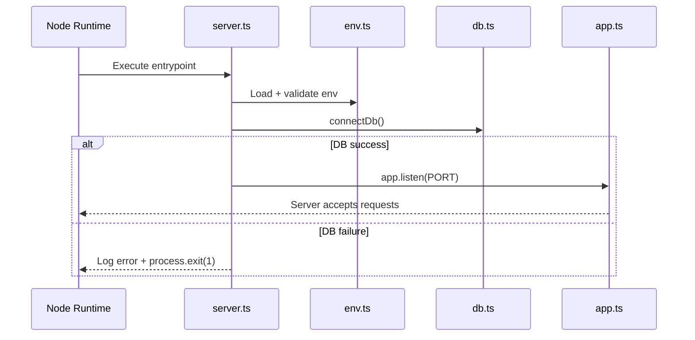
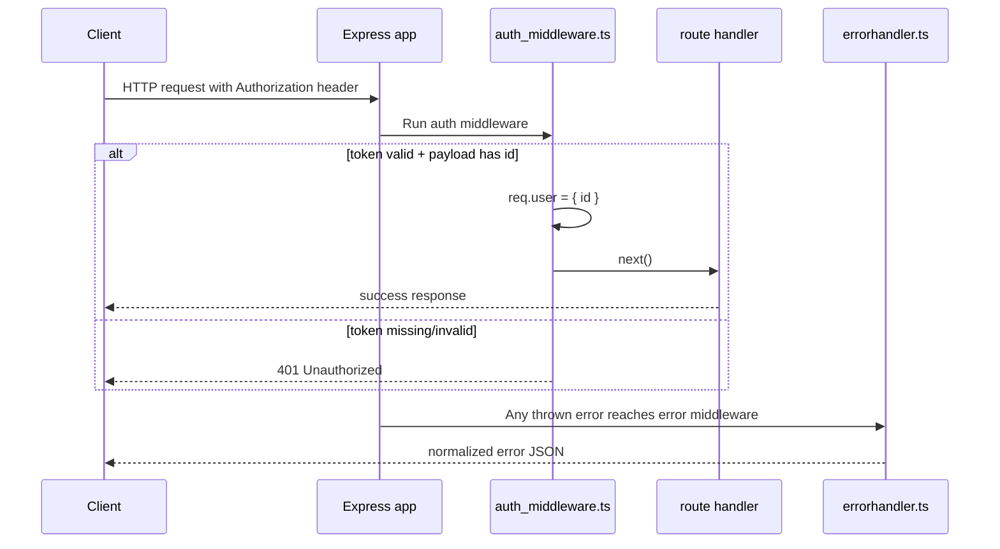
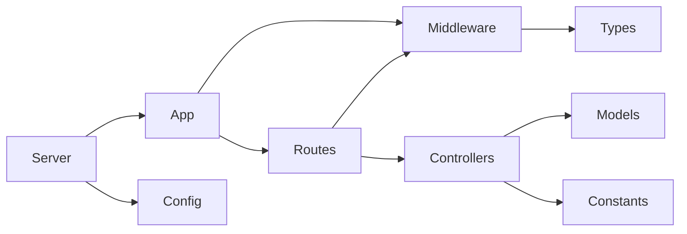

# Contact Backend TS — Explanation (Merged)

This document keeps both the original architecture notes and recent implementation updates.

---

## A) Original architecture notes (preserved)

## 1) High-level picture

The project is organized around a startup pipeline and middleware-driven request handling:

```mermaid
flowchart TD
    A[server.ts] --> B[env.ts validates env vars]
    A --> C[db.ts connects MongoDB]
    A --> D[app.ts starts Express app]

    D --> E[Global middleware: express.json()]
    D --> F[Routes]
    F --> G[auth_middleware.ts (protected routes)]
    F --> H[controllers (next step)]
    D --> I[errorhandler.ts (last middleware)]

    G --> J[express.d.ts type augmentation: req.user]
```

Key idea: `server.ts` bootstraps the app; `app.ts` defines HTTP behavior; middleware creates boundaries for security and error handling.

## 2) File-by-file purpose and importance

- `src/server.ts`: startup orchestrator (DB first, then listen, fail-fast on startup errors)
- `src/app.ts`: composition root (JSON parser, routes, error middleware)
- `src/config/env.ts`: runtime configuration boundary and validation
- `src/config/db.ts`: MongoDB connection boundary
- `src/middleware/auth_middleware.ts`: authentication gate (`Bearer` token, JWT verification)
- `src/middleware/errorhandler.ts`: global error normalization
- `src/types/express.d.ts`: Request augmentation (`req.user`)
- `src/constants/constants.ts`: shared literals (status codes/messages)

## 3) Startup sequence



## 4) Protected request flow



## 5) Middleware order reminder

Express executes middleware top-to-bottom:
1. Parse body (`express.json()`)
2. Route handlers / route-level middleware
3. Error middleware (`errorhandler.ts`) last

## 6) TypeScript design choices

- strict mode for safe assumptions
- `unknown`-first narrowing at trust boundaries
- Express Request augmentation over repeated assertions
- central env validation for fail-fast startup

## 7) Dependency direction



## 8) Original checklist (preserved)

- [ ] `env.ts` is the only place reading `process.env`
- [ ] `db.ts` does not swallow startup failures
- [ ] Auth middleware always responds or calls `next()`
- [ ] Error middleware is last in `app.ts`
- [ ] `req.user` is typed only via `express.d.ts`
- [ ] `npm run typecheck` passes before moving to next file

---

## B) Recent updates (new)

## Current run workflow

- `npm run dev`: runs TypeScript directly with `tsx watch src/server.ts`
- `npm run build`: compiles to `dist/`
- `npm run typecheck`: type validation only (`--noEmit`)

Important: `tsc -w` compiles continuously but does not run the server.

## Current state from latest code

- Auth route exists at `/api/contacts` and uses `protectToken`.
- `auth_middleware.ts` uses a payload type guard before assigning `req.user`.
- Error middleware is registered after routes in `app.ts`.
- App startup still requires all env vars: `PORT`, `MONGODB_URI`, `JWT_SECRET`.
- Type checking currently passes with `skipLibCheck: true`.

## Current improvement targets

- Keep unauthorized status usage fully consistent (constants vs raw `401`)
- Avoid logging sensitive Mongo connection values in `db.ts`
- Return `PORT` as `number` from `env.ts` after validation
- Move route handler logic toward controllers as project grows

---

## Quick mental model

Think in boundaries:
- Config boundary: `env.ts`
- Infrastructure boundary: `db.ts`
- Security boundary: `auth_middleware.ts`
- API boundary: `routes/*`
- Error boundary: `errorhandler.ts`

Strict TypeScript helps because each boundary converts untrusted input into trusted application state.